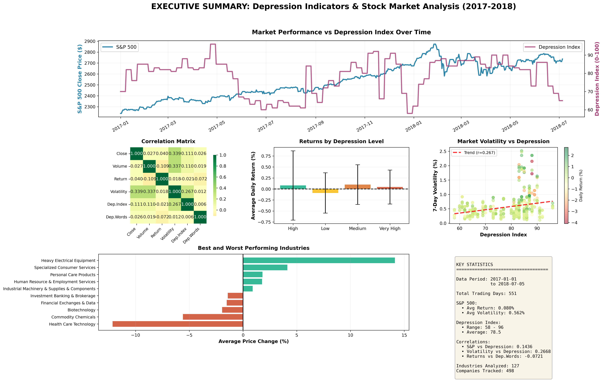
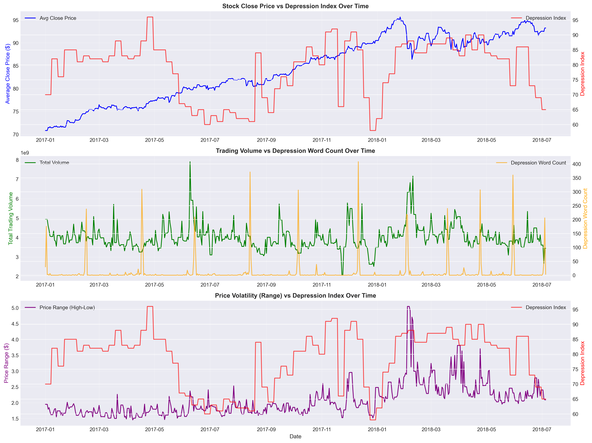
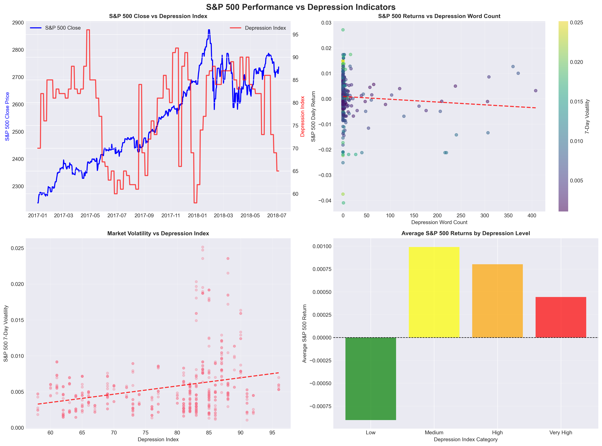
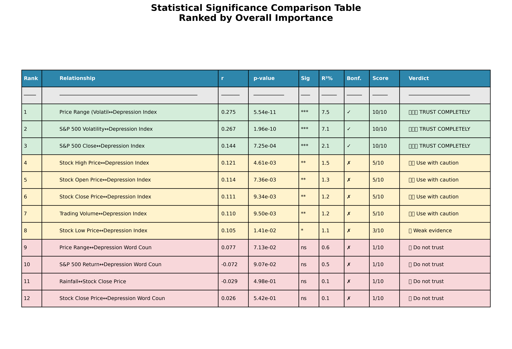
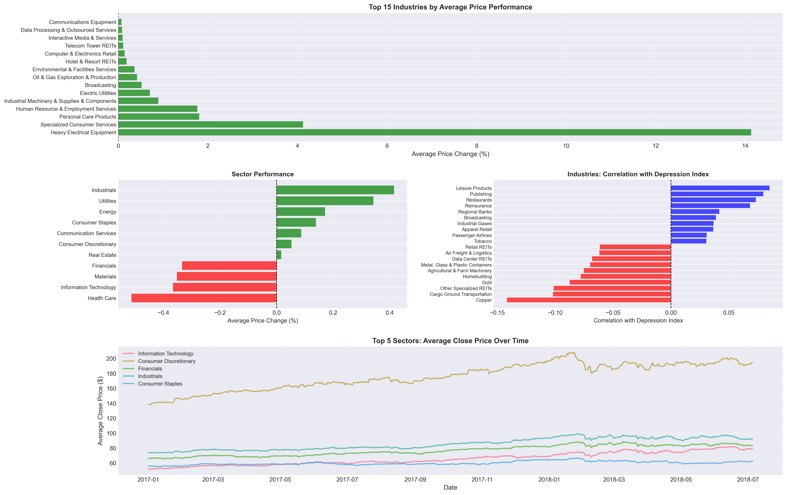

# 📊 Time Series Analysis: Depression Index & Market Volatility

> Behavioral Signals & Financial Markets (2017–2018)

---

## 📊 Executive Overview

This dashboard summarizes:
- Market trends vs depression index  
- Correlation structure  
- Volatility relationships  
- Industry differences  

---

## ⚡ TL;DR

- 600K+ time-series records analyzed  
- Significant correlation with volatility (p < 0.001)  
- Lag effect: 1–3 days  
- Industry variation observed  

👉 Behavioral signals relate to **uncertainty, not direction**

---

## 🧪 Time Series Analysis

Temporal patterns suggest sentiment changes **precede volatility**

---

## 📊 Statistical Results

- Volatility correlation: **0.275 (p < 0.001)**  
- Price correlation: weaker  

👉 Emotion impacts **risk perception**

---

## 🔬 Statistical Validation

- p-value filtering  
- Bonferroni correction  

✔ Only volatility relationships remain robust  

---

## 🏭 Industry-Level Analysis

- Consumer sectors → more sensitive  
- Infrastructure → less sensitive  

---

## ⚠️ Limitations

- News data: only header + first line used  
- Full-text validation not possible (compute limits)  
- Same-day news → trading impact unclear  
- Weather not aligned with trading locations  

👉 Only **depression index showed consistent significance**

---

## 📊 Dashboard

Demo: https://youtu.be/dxp3GlqZcoo

---

## 📌 Takeaway

- Behavioral signals → volatility  
- Lag effect exists  
- Industry differences matter  