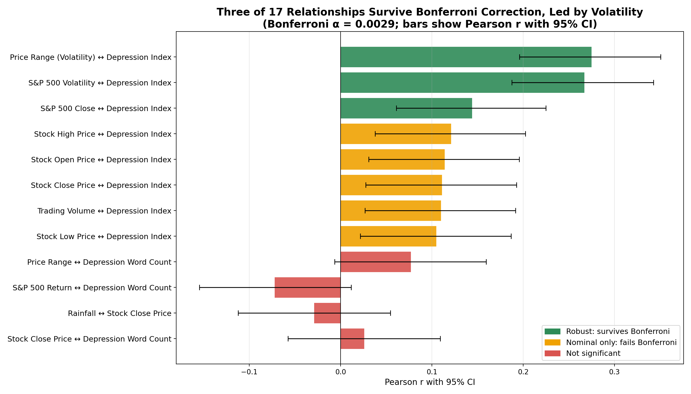
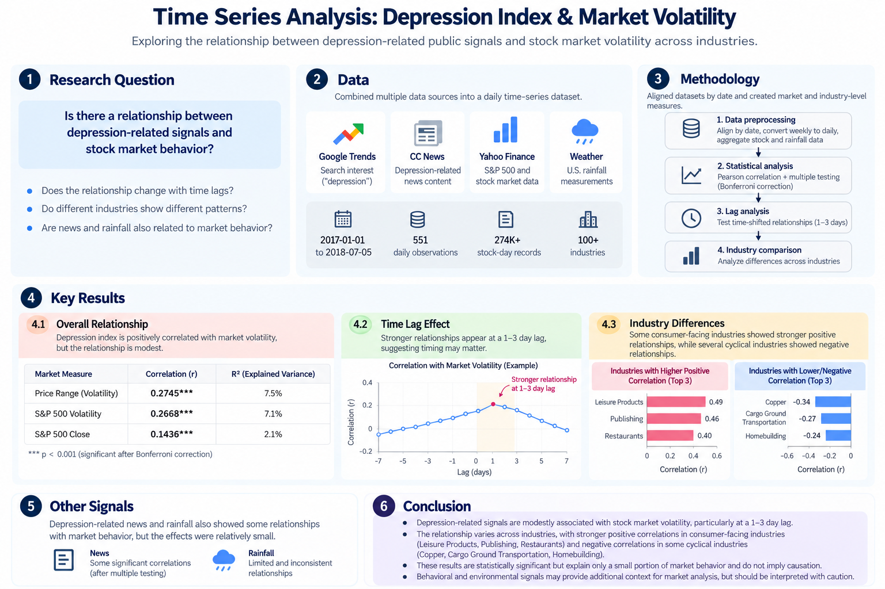

# 📊 Behavioral Signals & Market Volatility

> **Do public depression signals move with the stock market? (Jan 2017 – Jul 2018)**
> A time-series study of 498 companies across 127 industries, with multiple-comparison control to separate signal from noise.

---

## ⚡ TL;DR

- Integrated **600K+ multi-source records** (market prices, Google Trends, news text, weather) into PostgreSQL
- Tested **17 relationships**; only **3 survived Bonferroni correction** (α = 0.05 / 17 = 0.0029)
- The strongest and most robust signal: **depression index ↔ market volatility** (r = 0.275, 95% CI [0.196, 0.350], p < 0.001)
- Price levels, news word counts, and rainfall showed **weak or no reliable association**
- Built an interactive Flask dashboard for exploring results



---

## 🧠 Problem

Traditional financial models rely heavily on price-based indicators. Behavioral finance suggests that **collective emotion and sentiment** may also relate to market dynamics.

This project asks:

> **Does a public depression signal relate to market volatility, trading activity, or prices?**
> **Which of these relationships hold up after correcting for multiple testing?**

---

## 📦 Data

| Source | Variable | Notes |
|---|---|---|
| Google Trends | Depression Index (0–100) | Search interest for depression-related terms |
| CC-News | Depression word count | Headlines and first lines only (see Limitations) |
| Market data | OHLC prices, volume, S&P 500 | 498 companies, 127 industries, 11 sectors |
| Weather | Average national rainfall | Not aligned to trading locations |

**Final dataset:** 551 trading days (2017-01-01 to 2018-07-05), 17+ engineered time-series features (lags, rolling volatility, returns).

---

## 🧪 Methodology

1. **Pipeline:** multi-source ingestion → cleaning and date alignment → feature engineering → PostgreSQL storage
2. **Features:** daily returns, price range (high − low) as a volatility proxy, 7-day rolling S&P 500 volatility, lagged signals (t+1 to t+3)
3. **Testing:** Pearson correlations with 95% confidence intervals (Fisher z-transformation)
4. **Multiple-comparison control:** Bonferroni correction across all 17 tested relationships
5. **Robustness:** compared the depression index against alternative signals (news word count, rainfall)

---

## 📈 Results



| Relationship | r | p-value | Bonferroni |
|---|---|---|---|
| Price Range (Volatility) ↔ Depression Index | 0.275 | 5.5e-11 | ✅ Pass |
| S&P 500 Volatility ↔ Depression Index | 0.267 | 2.0e-10 | ✅ Pass |
| S&P 500 Close ↔ Depression Index | 0.144 | 7.3e-04 | ✅ Pass * |
| Individual stock prices and volume ↔ Depression Index | 0.105 – 0.121 | 0.005 – 0.014 | ❌ Fail |
| Word count and rainfall relationships | −0.072 – 0.077 | > 0.05 | ❌ Not significant |

\* The S&P 500 Close relationship involves two trending series, so part of this correlation may reflect shared trends rather than a direct association (see Limitations).

**Key insight:** the depression signal relates to **uncertainty (volatility)** more than to **direction (price level or returns)**. S&P 500 returns showed no significant relationship with the depression index.

### Lag analysis
Lag windows from t+1 to t+3 were evaluated; the strongest relationships appeared at a 1–3 day lag, suggesting the signal may precede volatility changes. This is an exploratory observation, not a causal test.

### Industry-level patterns
Industry-level correlations with the depression index were small (|r| < 0.15). Consumer-facing industries (leisure products, publishing, restaurants) tended toward positive correlations and capital-intensive industries (copper, cargo transportation, homebuilding) toward negative ones. **These differences have not yet been formally tested** and should be read as descriptive.

### Alternative signals
- **News word count:** no meaningful relationship with the depression index (r = 0.006, 95% CI [−0.078, 0.089]) or with market variables
- **Rainfall:** no significant relationship with stock prices (r = −0.029, p = 0.50)

---

## ⚠️ Limitations

- **Trending series:** correlations between price levels and a slowly moving index can be inflated by shared trends. Volatility measures are less affected, which is one reason they are the more credible result.
- **Autocorrelation:** consecutive trading days are not independent, so the effective sample size is smaller than 551 and p-values are likely optimistic.
- **News text:** only headlines and first lines were processed due to computational constraints.
- **Weather alignment:** national average rainfall does not match where trading decisions are made.
- **Associative, not causal:** results describe co-movement, not cause and effect.

---

## 🔮 Future Work

- **Formally test industry differences** (regression with industry interaction terms, with multiple-comparison control)
- Use **autocorrelation-robust inference** (e.g., Newey–West standard errors) or differenced series
- Apply **Granger causality** tests to examine lead–lag direction
- Extend to volatility forecasting (e.g., GARCH, XGBoost)
- Pair region-specific trading data with localized weather

---

## 📊 Interactive Dashboard

A Flask dashboard supports exploration of time series, industry comparisons, lag effects, and statistical summaries.


The cloud version of this pipeline (EventBridge → Lambda → S3 → EC2 → RDS PostgreSQL, with a Streamlit front end) is documented in the companion repository: [Cloud-Based Data Pipeline & Analytics Platform (AWS)](https://github.com/boa74/Cloud-Based-Data-Pipeline-Analytics-Platform-AWS-)

---

## 🛠️ Tech Stack

Python (pandas, NumPy, SciPy) · PostgreSQL · Flask · Plotly

---

## 📁 Project Structure

```
.
├── src/              # data processing and analysis
├── flask/            # dashboard
├── config/
├── docs/
├── images/analysis/  # figures used in this README
└── README.md
```

---

## 📬 Contact

**Boa Kim** · M.S. Applied Analytics, Columbia University
GitHub: https://github.com/boa74 · LinkedIn: https://linkedin.com/in/boah-kim
